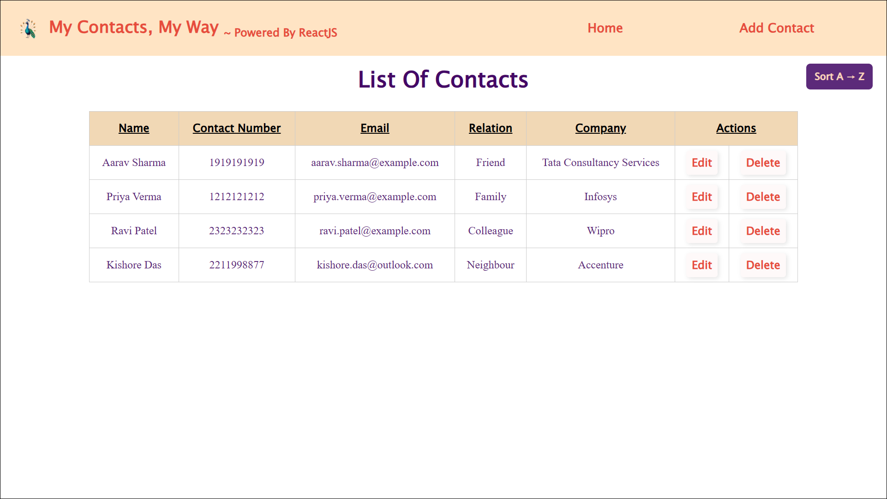
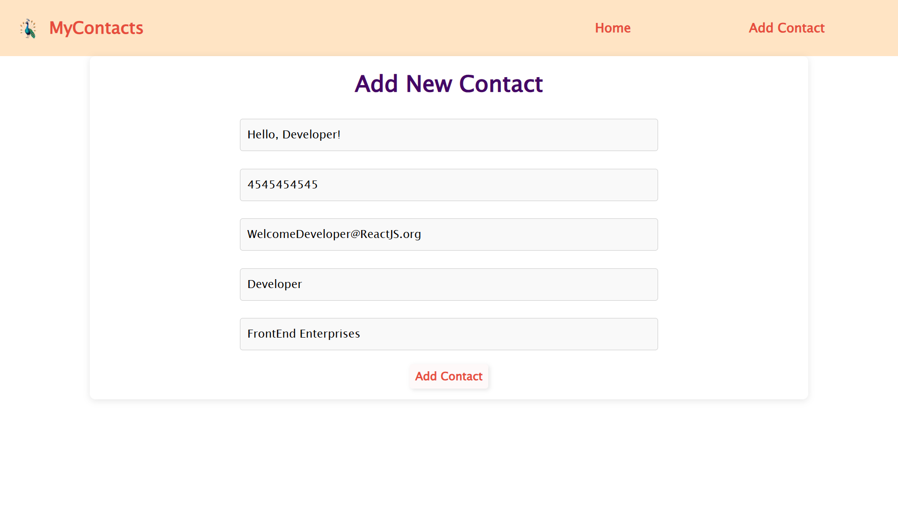

# My Contacts, My Way - Powered by React  

## 📌 Project Overview  
**My Contacts, My Way** is a **ReactJS-based Contact Management Application** that provides an intuitive and efficient way to manage personal and professional contacts. It enables users to **add, edit, and delete contacts seamlessly** while offering **sorting functionalities** (ascending, descending, and reset). Built with a modular approach, the project ensures clean architecture, scalability, and ease of maintenance.  

## ✨ Features  
- **CRUD Operations** – Add, Edit, and Delete Contacts  
- **Sorting Functionality** – Sort contacts by name (Ascending & Descending)  
- **Reset Sorting** – Restore the original order of contacts  
- **Intuitive UI** – A simple and user-friendly interface with a responsive layout  
- **State Management** – Efficient state handling with React’s component-based architecture  
- **Mock Backend** – Uses JSON Server to simulate API responses  

---

## 🛠 Tech Stack  
- **Frontend:** ReactJS, CSS Modules  
- **Routing:** React Router  
- **Mock Backend:** JSON Server  

---

## 📂 Project Structure  
```plaintext
mycontacts/
├── public/
│   ├── HomePage.png            # Screenshot of the homepage
│   ├── AddContactPage.png      # Screenshot of the Add Contact page
├── src/
│   ├── components/             # Reusable components
│   │   └── navbar/             # Navbar component
│   │       ├── Navbar.jsx
│   │       └── navbar.module.css
│   ├── pages/                  # Different pages of the app
│   │   ├── home/               # Contact listing with sorting
│   │   │   ├── Home.jsx
│   │   │   └── home.module.css
│   │   ├── addcontact/         # Add new contact form
│   │   │   ├── AddContact.jsx
│   │   │   └── addcontact.module.css
│   │   ├── editcontact/        # Edit contact form
│   │   │   ├── EditContact.jsx
│   │   │   └── editcontact.module.css
│   │   └── Layout.jsx          # Main Layout for routing and structure
│   ├── router/                 # React Router setup
│   │   └── Router.jsx
│   ├── global.css              # Global styles
│   ├── App.jsx                 # Main App component
│   ├── main.jsx                # Entry point for React
└── index.html                  # Main HTML file
```  

---

## 📸 Screenshots  
### **Homepage**  
  

### **Add Contact Page**  
  

---

## ⚡ Running the Mock Backend  
To simulate the backend using JSON Server, run the following command:  
```bash
npx json-server --watch api.json --port 5000
```
